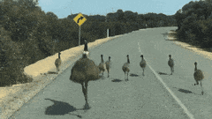

```{r setup, include=FALSE}
knitr::opts_chunk$set(echo = TRUE)
```

------------------------------------------------------------------------

<br>

<p align="center">
<center><strong>Time to go for a walk mate!</strong></center>

</p>

<br>

<p align="center"></p>

<br> <br>

This article analysis pedestrian walking trend throughout the last 9 years -2013/2021-, using open data published by the [City of Sydney Council](https://data.cityofsydney.nsw.gov.au/).

# 1. Libraries and database

## 1.1 Loading libraries

For this analysis, we'll be using the following libraries:

```{r message=FALSE, warning=FALSE}
library(ggplot2)
library(knitr)
library(leaflet)
library(sf)
library(tidyverse)
library(lubridate) 
library(plotly)
library(gganimate) #GIF maker

#For any missing library, remember to <install.packages('PACKAGE-NAME')>

options(scipen=999) #turn off scientific notation
```

## 1.2 Loading data

Data available at:

-   [Walking count (csv)](https://data.cityofsydney.nsw.gov.au/search?q=walking)

-   [Walking sites (shapefile)](https://data.cityofsydney.nsw.gov.au/datasets/cityofsydney::walking-count-sites/explore?location=-33.881562%2C151.205384%2C14.18)

```{r message=FALSE, warning=FALSE, out.width = '100%'}
df <- read.csv('data/Walking_count_surveys.csv', stringsAsFactors = TRUE, encoding = "UTF-8")

sites <- st_read('data/Walking_count_sites.shp') %>% 
  rename(SiteID=Site_ID) %>% 
  st_difference()
```

# 2. Brief insight

## 2.1 Pedestrian counting

Let's have a look at the survey dataset...

```{r message=FALSE, warning=FALSE}
head(df)
```

Brief insight:

Each site contains the following information:

    -   ID & location details

    -   Period (weekeday / weekend)

    -   Season of the year (fall / sping)

    -   Total pedestrian counted per day

    -   Total pedestrian counted per hour (6 am to 11 pm)

```{r message=FALSE, warning=FALSE, out.width = '100%'}
paste('The dataset contains information of ', length(unique(df$SiteID)), ' sites and ', length(unique(df$Location)), ' locations (clustered sites)')
```

## 2.2 Sites

Now, a quick inspection of the geographical data we'll be we working with:

```{r message=FALSE, warning=FALSE}
kable(head(sites))
```
It contains information of:

    -   ID & location details

    -   Geometry


```{r message=FALSE, warning=FALSE, out.width = '100%'}
sites <- sites %>%
  select(SiteID, Location) %>% #IDs for joing data
  mutate(long = st_coordinates(.)[,1],
         lat = st_coordinates(.)[,2])

leaflet(sites) %>%
  addTiles() %>%
  addProviderTiles(providers$CartoDB) %>% 
  addCircles(lng = ~long, 
             lat = ~lat, 
             weight = 4,
             popup = ~paste('<strong>',"Location:",'</strong>', Location))
```

## 2.2 Joining data by ID

Many Locations are clustered under the same name. We'll create a new tag to identify each one of them separately, using the siteID information

```{r message=FALSE, warning=FALSE, out.width = '100%'}
sites <- sites %>% 
    mutate(Location_site=paste(SiteID,'-',Location))

df <- df %>% 
  select(-Location) %>% #repeated in both sets of data
  left_join(sites, by='SiteID')
```


# 3. Active mobility trend - time analysis

## 3.1 Periods and days

<center><strong>Spring or Autumn? Weekdays or weekends?</strong></center>

```{r message=FALSE, warning=FALSE, out.width = '100%'}
df <-   dplyr::filter(df, !Year==2022) #Spring's not included yet!

days <- df %>% 
  group_by(Period, Month) %>% 
  summarise(Amount=n(),
            Avg=round(mean(TotalCount),2))

plot_ly(data = days,
        x = ~Month,
        y = ~Avg,
        color = ~Period,
        type = "bar") %>% 
   layout(title = 'Pedestrian behaviour - Periods and days', xaxis = list(title = 'Period'), 
         yaxis = list(title = 'Average amount of pedestrians'))
```

In average, there are more pedestrians counted during Autumn rather than Spring. 

<strong>Weekdays are busier</strong>, specially when it comes to Autumn. 

There's a higher decline in the amount of pedestrians walking on weekends during Autumn, representing a drop of 22% of the corresponding amount for the same season during weekdays.  

<strong>During Spring people tend to walk more on weekends</strong> compared to Autumn. For this case, the reduction represents 14% of what is counted on weekdays.


<center><strong>Seasons and locations</strong></center>

```{r message=FALSE, warning=FALSE, out.width = '100%'}
weekdays <- df %>% 
  dplyr::filter(Period=='weekday') #leaving the weekends behind 

weekdays_2 <- weekdays %>% 
  group_by(Location_site, Month) %>% 
  summarise(Amount=sum(TotalCount)) %>% 
  mutate(Perc=Amount/sum(weekdays$Amount)*100) %>% 
  left_join(sites, by='Location_site') %>% 
  arrange()

plot_ly(data=weekdays_2,
        x = ~Location_site,
        y = ~Amount,
        color = ~Month,
        type = "bar") %>% 
   layout(title = 'Pedestrian behaviour - Periods and days', xaxis = list(categoryorder = "total ascending"), 
         yaxis = list(title = 'Average amount of pedestrians')) 
```


```{r message=FALSE, warning=FALSE, out.width = '100%'}
spring_over_autumn <- weekdays_2 %>% 
  pivot_wider(names_from = Month, values_from = Amount) %>% 
  mutate(DIF_spring=Spring/Autumn*100,
         TIME=case_when(
           DIF_spring > 100 ~ "Spring",
           DIF_spring < 100 ~ "Autumn")) %>% 
  select(Location_site, DIF_spring, TIME)

qpal <- colorFactor(palette = c("#8da0cb", "#66c2a5"),
                               domain = c("Spring", "Autumn"))

sites %>% 
  left_join(spring_over_autumn, by='Location_site') %>% 
  
  leaflet() %>%
  addTiles() %>%
  addProviderTiles(providers$CartoDB) %>% 
  addCircles(lng = ~long, 
             lat = ~lat, 
             radius = ~sqrt(DIF_spring)*5,
             color = ~qpal(TIME),
             popup = ~paste('<strong>',"Location:",'</strong>', Location_site, '<br/>',
                            '<strong>',"Most frequent season:",'</strong>', TIME)) %>% 
    addLegend("bottomright", pal = qpal, values = ~TIME,
    title = "Busiest season",
    opacity = 1)
```

George Street is by far the most frequent location, followed by Park Street, Martin Place, Oxford Street and King Street.

```{r message=FALSE, warning=FALSE, out.width = '100%'}
weekdays %>% group_by(Location) %>% summarise(Amount=sum(TotalCount)) %>%
  arrange(-Amount)
```

## 3.2 Trend over the years

```{r message=FALSE, warning=FALSE, out.width = '100%'}
weekdays_year_LOC <- weekdays %>% 
  group_by(Location, Year) %>% 
  summarise(Amount=sum(TotalCount)) %>% 
  left_join(sites, by='Location') %>% 
  drop_na()
```

```{r message=FALSE, warning=FALSE, out.width = '100%'}
ggplot(weekdays_year_LOC) + 
  geom_point(aes(x=Location, y=Amount, size=Amount), color='#301934', fill='#301934', alpha = 0.6, show.legend = FALSE) +
  labs(x='Location',
       y='Amount of pendestrians counted', 
       title='Pedenstrian behaviour throughout the years', 
       subtitle = '{closest_state}',
       caption = 'Source: https://data.cityofsydney.nsw.gov.au/')+
  theme_minimal()+
  scale_y_log10()+ #log scale
  theme(axis.text.x = element_text(angle=90, hjust=1, size=6))+
  transition_states(states = Year)+
  shadow_wake(wake_length = 0.1, alpha=.05, colour = 'grey')
```
Many site are grouped within 1 single location. Time to fix the aggregation issue, grouping by sites instead of locations...

**Which locations increased its amount of pedestrians the most?**

```{r message=FALSE, warning=FALSE, out.width = '100%'}
weekdays_year_LOCID <- weekdays %>% 
  group_by(Location_site, Year) %>% 
  summarise(Amount=sum(TotalCount)) %>% 
  left_join(sites, by='Location_site')
```

```{r message=FALSE, warning=FALSE, out.width = '100%', fig.height=10}
ggplot(weekdays_year_LOCID) + 
  geom_col(aes(x=Amount, y=Location_site), color='#301934', fill='#301934', alpha = 0.6, show.legend = FALSE) +
  labs(x='Amount of pendestrians counted',
       y='Site (disaggregated location)', 
       title='Pedenstrian behaviour throughout the years', 
       subtitle = '{closest_state}',
       caption = 'Source: https://data.cityofsydney.nsw.gov.au/')+
  theme_minimal()+
  theme(axis.text.y = element_text(angle=0, size=5))+
  transition_states(Year, transition_length = 2, state_length = 1)+
  ease_aes('sine-in-out')
```

As some years contain missing information (NA values), we'll get rid of the empty instances.

```{r message=FALSE, warning=FALSE, out.width = '100%'}
weekdays_var <- weekdays_year_LOCID %>%   
  pivot_wider(names_from = Year, values_from = Amount) %>% 
  drop_na() %>% #dropping missing years
  rowwise() %>% 
  mutate(Average = sum(c_across("2013":"2021")/8),
        STD=sd(c_across("2013":"2021")),
        CV=STD/Average, 
        Per1=sum(c_across("2013":"2016")/4),
        Per2=sum(c_across("2017":"2021")/4),
        TOT_V=Per2/Per1*100,
        VAR=case_when(
          TOT_V > 100 ~ "Increased recently",
          TOT_V < 100 ~ "Decreased recently"))
```

```{r message=FALSE, warning=FALSE, out.width = '100%'}
plot_ly(data=weekdays_var,
        x = ~Location_site,
        y = ~CV,
        color = ~VAR,
        type = "bar") %>% 
   layout(title = 'Pedestrian behaviour - variation over time (coeficient of variation)', xaxis = list(categoryorder = "total ascending"), 
         yaxis = list(title = 'Coefficient of variation')) 
```

```{r message=FALSE, warning=FALSE, out.width = '100%'}
qpal <- colorFactor(palette = c("#8da0cb", "#66c2a5"),
                               domain = c("Increased recently", "Decreased recently"))

weekdays_var %>% 
  select(Location_site, CV, TOT_V, VAR) %>% 
  left_join(sites, by='Location_site') %>% 

leaflet() %>%
  addTiles() %>%
  addProviderTiles(providers$CartoDB) %>% 
  addCircles(lng = ~long, 
             lat = ~lat, 
             radius = ~sqrt(CV) *150,
             color = ~qpal(VAR),
             popup = ~paste('<strong>',"Location:",'</strong>', Location_site, '<br/>',
                            '<strong>',"Coefient of variation:",'</strong>', round(CV,2), '<br/>',
                            '<strong>',"Recent effect:",'</strong>', round(TOT_V,2), '%'))%>% 
    addLegend("bottomright", pal = qpal, values = ~VAR,
    title = "Recent effect",
    opacity = 1)

```

Many locations in the CBD show a decline tendency over the last few years. This could possibly be a consequence of the pandemics. 

Cleveland street shows important changes in pedestrian trend, with a recent drop in its amount. 

King street, between Enmore Rd. and Sydney Park shows an increase in rates, same as Oxford Street and Moore Park Road. 
<br> 

<div class="tocify-extend-page" data-unique="tocify-extend-page" style="height: 0;"></div>

<br> 
<p align="center"></p>
<br> 
<center><strong>Thanks for reading!</strong></center>
<br> 
<br> 
<div class="tocify-extend-page" data-unique="tocify-extend-page" style="height: 0;"></div>
